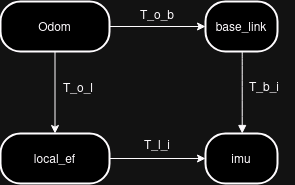

# Imu sensor model

The plugins `Imu2D` and `Imu3D` are used to interface with IMU sensors and insert their measurements into the graph. In general an IMU can output three different vectorial variables:

- an orientation
- an angular velocity
- a linear acceleration

Together with their respective covariance matrixes. In the context of sensor fusion algorithms, it is important to understand how to handle these measurements to generate correct constraints on the robot state. 

## Reference frames

**N.B.** In this markdown we reference to a specific family of IMU devices, the **xsens MTi series**, since these are the ones installed on the rovers at Roxy. Anyhow, the ideas behind what will be described here are general and apply to other devices as well, but users should refere to specific manufacturer manuals. For the **xsens MTi series** manual, see [1].

There are 2 important reference frames that we need to consider: `imu` and `local_ef` (named `S_xyz` and `L_xyz` respectively in the manual). `imu` is a sensor-fixed frame while `local_ef` is a local-earth fixed frame. The latter can be defined according to different conventions `enu` (east-north-up, default), `ned` (north-east-down), or `nwu` (north-west-up).

The IMU measures:
- absolute orientations wrt `local_ef` 
- angular velocities and linear accelerations wrt `imu`


## Fusing IMU measures

In state estimation, the goal is to establish the robot state, typically its pose, e.g. position and orientation of `base_link` frame wrt `odom` frame [2], together with its velocity and acceleration, both in `base_link` frame. As already said above, measures provided by IMU are in different frames and need to be transformed correctly before being fed them to the filter. 

#### Angular velocity and linear acceleration

For angular velocities and linear accelerations, this is easily done, since they only need to be written wrt `base_link`. The fuse stack already provides such options, via the parameters `twist_target_frame` and `acceleration_target_frame`. Here is an example of usage in `fixed_lag_smoother` config file:

```yaml
imu_plugin:
  angular_velocity_dimensions: ['roll', 'pitch', 'yaw']
  twist_target_frame: 'base_link'
  linear_acceleration_dimensions: ['x', 'y', 'x']
  acceleration_target_frame: 'base_link'
```
Setting the parameters as non-empty will enforce the sensor processing pipeline to apply a transformation to both the variable and its covariance.

#### Orientation

Orientation measures can be employed by the filter as absolute, e.g. wrt the absolute (local) reference frame `odom`, or as relative. In absolute mode, measurements are treated as absolute orientations of IMU wrt the local-earth fixed frame. In differential mode, instead, measures are treated as a change of IMU orientation over time, e.g. an angular velocity. In both cases, what we have to do is to obtain from the measure some information about how the robot `base_link` behaves wrt the `odom` frame. 

Let's consider the transformation tree involved. As a convention, we will mark a transform as $T_j^i$, reading: transformation matrix from *parent frame* `i` to *child frame* `j`. The tf tree is the following:


<p align="center">
    


The involved transformations are:

- $T_l^o$, is fixed and known, depending on the convention choosen for the local-earth fixed frame 
- $T_i^l$, is the one outputted by the IMU (orientation only)
- $T_i^b$, is fixed and known, from robot URDF
- $T_b^o$, is the one that we need to derive from the IMU measure and insert into the graph

Chaining the transformations, we obtain:

$$T_b^o = T_l^o * T_i^l * (T_i^b)^{-1}  \;(1)$$

Two additional considerations have to be made:

1) As the standard in ROS2 [3], we consider that IMU orientation measures are in enu reference frame;
2) Since our IMU is a VRU (Vertical Reference Unit), it does not provide an absolute heading reference.

These two allow us to set $T_l^o = I_d$, meaning that we suppose that the `odom` frame is aligned with `local_ef` frame, with Z axis aligned with gravity vector and pointing upwards, and the heading initialized as the X axis points in the direction in which the rover is spawned. Eq. (1) simplifies to:

$$T_b^o = T_i^l * (T_i^b)^{-1}  \;(2)$$

Meaning that we just have to transform the orientation measures in `base_link` frame. As for angular velocities and linear accelerations, this is already done by Fuse by setting the `orientation_target_frame`. Here there is an example of a full IMU configuration in **absolute** mode:

```yaml
imu_plugin:
  type: fuse_models::Imu3D  # use fuse_models::Imu2D for plane motion 
  motion_models: [associated_motion_model]
  orientation_dimensions: ['roll', 'pitch'] # absolute yaw angle is not available
  orientation_target_frame: 'base_link'
  angular_velocity_dimensions: ['roll', 'pitch', 'yaw']
  twist_target_frame: 'base_link'
  linear_acceleration_dimensions: ['x', 'y', 'x']
  acceleration_target_frame: 'base_link'
  differential: false # set to true for differential mode
```

#### References

[1] [Xsens MTi manual](https://www.xsens.com/hubfs/Downloads/Manuals/MTi_familyreference_manual.pdf)

[2] [rep-0105](https://www.ros.org/reps/rep-0105.html)

[3] [rep-0145](https://www.ros.org/reps/rep-0145.html#frame-conventions)